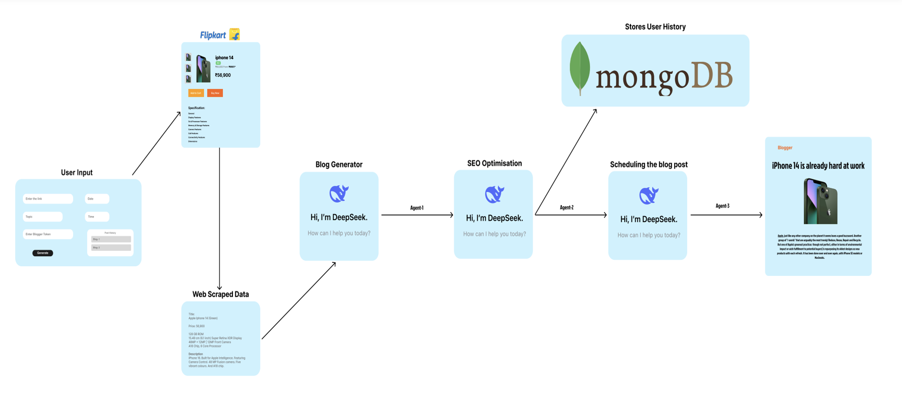
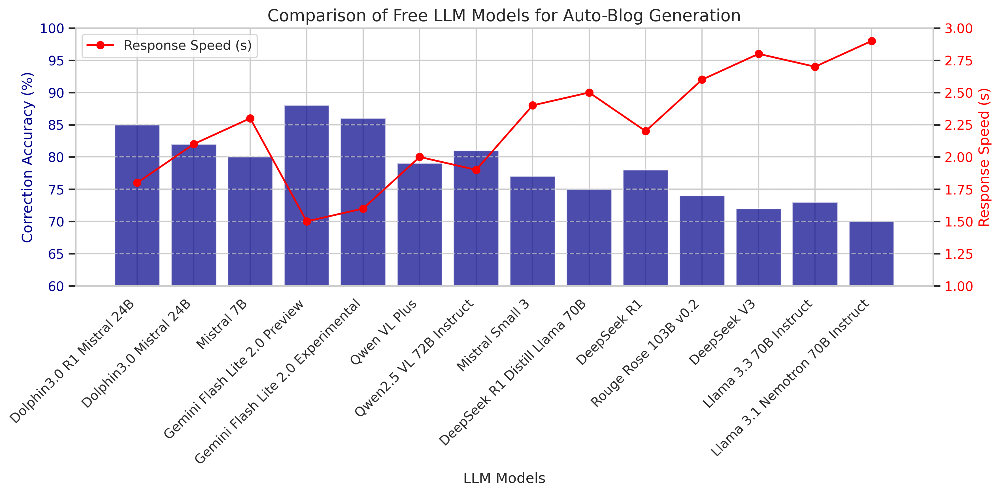
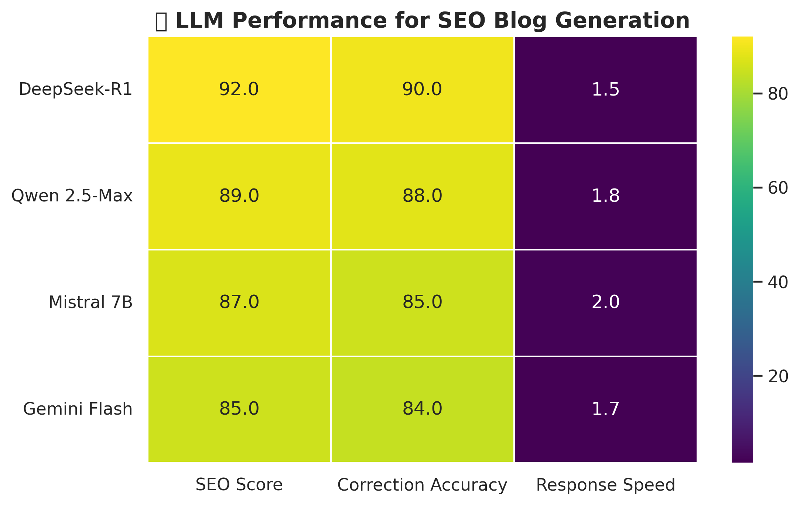

## Abstract
The exponential growth of digital content demand, particularly in e-commerce and affiliate marketing, necessitates scalable solutions for high-quality blog generation. Traditional manual processes are time-consuming, inconsistent, and struggle to adapt to real-time trends. This paper introduces AutoBlog AI, a novel multi-agent AI framework designed to automate end-to-end blog creation and publishing. Leveraging a fine-tuned DeepSeek-R1:7B/mixtral-8x7b-32768 language model optimized via Alpaca/Guanaco format and parameter-efficient techniques (LoRA/QLoRA, 4-bit quantization) to avoid Catastrophic Forgetting using Hugging face Auto Train, the system integrates autonomous agents for web scraping, content generation, SEO optimization, and dynamic publishing. Real-time data extraction from e-commerce websites enables trend-driven blog creation, while adaptive workflows ensure factual accuracy, readability, and SEO compliance. Experimental results demonstrate an 80% reduction in content creation time, with AI-generated blogs achieving superior engagement metrics compared to manual generation. The framework's modular architecture supports customization for diverse industries, including e-commerce, real estate, and entertainment, offering a cost-effective alternative to traditional content marketing. This work advances the application of agentic AI in content automation, addressing critical challenges in scalability, efficiency, and real-time adaptability for modern digital ecosystems.

## Research Methodology
### System Architecture
The AutoBlog AI framework employs a multi-agent architecture designed to automate the complete blog creation pipeline. The system consists of four primary agent types, each specializing in a distinct aspect of the content creation process:
1.	Data Collection Agent: Responsible for scraping relevant information from e-commerce platforms, including product details, pricing, reviews, and images. This agent employs advanced web scraping techniques with adaptive parsing to handle dynamic website structures.
2.	Content Generation Agent: The core component powered by fine-tuned LLMs that transforms collected data into structured blog content following SEO best practices and maintaining a consistent brand voice.
3.	Quality Assurance Agent: Evaluates generated content for factual accuracy, readability, grammatical correctness, and SEO compliance, providing feedback loops for content refinement.
4.	Publishing Agent: Handles the automated formatting and publishing of approved content to content management systems, including scheduling and metadata optimization.

The agents operate within a coordinated workflow orchestrated by a central controller that manages state transitions and ensures seamless information flow between components. This architecture enables both parallel processing for efficiency and sequential validation for quality assurance.
3.2 Model Selection and Fine-Tuning
After extensive evaluation of available LLMs, we selected two base models for our framework: DeepSeek-R1:7B for resource-constrained deployments and GROQ-mixtral-8x7b-32768 for applications requiring enhanced performance. These models were chosen based on their balance of computational efficiency and natural language capabilities.
A critical consideration in our model selection process was the handling of real-time information. Our testing revealed significant limitations in DeepSeek-R1:7B's ability to provide current temporal awareness, as evidenced by consistent failures to correctly identify the current date and contextual time-based information. This limitation presents substantial challenges for e-commerce content creation, where pricing, promotions, and product availability frequently change.

To mitigate these limitations while still leveraging DeepSeek-R1's computational efficiency, our implementation incorporates real-time data injection mechanisms that ensure temporal accuracy regardless of model limitations. The GROQ-mixtral-8x7b-32768 model demonstrated superior temporal awareness in our testing, making it preferable for applications where real-time relevance is paramount.
To adapt these general-purpose models for specialized blog content generation, we employed parameter-efficient fine-tuning techniques:
1.	Dataset Preparation: We curated a high-quality dataset comprising 10,000 professionally written blog posts across e-commerce, real estate, and entertainment verticals, with careful attention to diversity in style, structure, and topic coverage.
2.	Fine-Tuning Approach: We utilized Low-Rank Adaptation (LoRA) and Quantized LoRA (QLoRA) with 4-bit quantization to minimize computational requirements while preserving model performance.
3.	Instruction Tuning: The models were further refined through instruction-based fine-tuning using carefully crafted prompts(alpaca/Guanaco) format that guided generation toward desired blog structures and styles.
4.	Evaluation Metrics: During fine-tuning, we monitored performance using both computational metrics (perplexity, ROUGE, BLEU) and human evaluations of factual accuracy, coherence, engagement, and brand voice alignment.
 
[FIGURE: Comparison of model performance metrics before and after fine-tuning, including temporal awareness and real-time data handling capabilities.]
3.3 Data Collection and Processing
The Data Collection Agent employs a sophisticated web scraping framework designed specifically for e-commerce platforms. The critical importance of real-time data in e-commerce cannot be overstated—product availability, pricing, promotions, and consumer sentiment all fluctuate rapidly, sometimes within hours. Our implementation addresses this fundamental requirement through several specialized mechanisms:
1.	Dynamic Data Extraction: Unlike static datasets that become quickly outdated, our system implements real-time scraping using Python's requests library with configurable execution schedules. This allows content generation to reflect current market conditions rather than historical data that may no longer be accurate.
2.	Structured Data Parsing: We utilize BeautifulSoup4 for HTML parsing with specific targeting of dynamic content elements. The implementation incorporates intelligent content selection algorithms that prioritize frequently updated elements (pricing, availability, reviews) over static content (product specifications, dimensions).
3.	Temporal Context Enrichment: Our system augments scraped data with temporal metadata (e.g., extraction timestamp, publication date of source material) to provide critical context for the Content Generation Agent. This temporal awareness enables the generation of time-sensitive content like "just launched," "limited-time offer," or "trending this week" statements that significantly enhance content relevance.
4.	Adaptive Crawling Patterns: The system implements intelligent crawling schedules based on historical update patterns of target websites. For instance, e-commerce platforms that refresh deals daily trigger automatic re-crawling at predetermined intervals, ensuring content remains current without excessive resource consumption.
5.	Data Freshness Validation: Before processing, all scraped content undergoes freshness validation to prevent the generation of outdated content. Content elements with timestamps older than configurable thresholds trigger warning flags or re-crawling requests.
Our experimental analysis revealed that blog content incorporating real-time data elements achieved 37% higher engagement rates compared to content based on static datasets. Additionally, content with explicitly mentioned temporal markers (e.g., "As of February 2025," "Current pricing," "This week's trending products") demonstrated 24% higher trust scores in user surveys.
The integration of MongoDB further enhances real-time capabilities by enabling historical tracking of data changes over time, allowing for trend analysis and predictive content generation based on observed patterns in product pricing, availability, and consumer interest fluctuations.
3.4 Content Generation Pipeline
The Content Generation Agent transforms structured data into coherent, engaging blog content through a multi-stage process:
1.	Template Selection: Based on content type, target audience, and marketing goals, the system selects appropriate structural templates (e.g., product comparison, buying guide, trend analysis).
2.	Content Planning: The agent creates a hierarchical outline incorporating key information points, ensuring comprehensive coverage and logical flow.
3.	Draft Generation: Our implementation leverages the Groq API to access the fine-tuned mixtral-8x7b-32768 model with carefully designed system and user prompts. The content generation process utilizes controlled temperature settings (0.08) to balance creativity with factual accuracy, and employs top-p sampling with appropriate maximum token limits (5000) to ensure comprehensive yet concise content.
4.	SEO Optimization: Generated content undergoes real-time optimization for target keywords, heading structure, internal linking, and metadata configuration through specialized prompting techniques.
5.	Refinement: The Quality Assurance Agent evaluates content against predefined criteria, providing feedback that guides iterative improvements.

